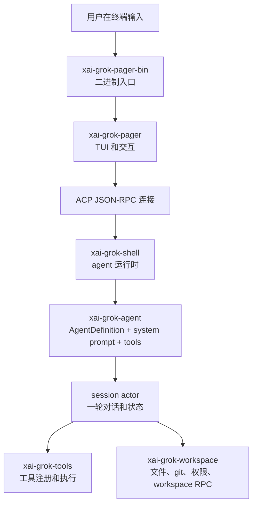

# 01. 项目地图

## 根目录

仓库根目录最重要的是这些文件和目录：

| 路径 | 作用 |
| --- | --- |
| `README.md` | 项目介绍、构建命令、官方文档入口、仓库布局。 |
| `Cargo.toml` | Rust workspace 根配置。注意文件顶部写着自动生成，正常开发优先改各 crate 自己的 `Cargo.toml`。 |
| `Cargo.lock` | 锁定依赖版本。 |
| `rust-toolchain.toml` | 指定 Rust 工具链版本。 |
| `crates/` | 主要 Rust 源码，几乎所有一方代码都在这里。 |
| `prod/mc/` | 产品侧共享类型，目前主要是 `cli-chat-proxy-types`。 |
| `third_party/` | vendored 第三方代码，比如 Mermaid 图渲染相关库。 |
| `bin/protoc` | hermetic 工具入口，README 提到需要 DotSlash 支持。 |

根 `Cargo.toml` 的 workspace members 很多，但读代码时可以先抓主干：

```text
crates/codegen/xai-grok-pager-bin
crates/codegen/xai-grok-pager
crates/codegen/xai-grok-shell
crates/codegen/xai-grok-agent
crates/codegen/xai-grok-tools
crates/codegen/xai-grok-workspace
```

## 代码分层

可以把整个项目想成一条从“用户输入”到“工具执行”的流水线：



这张图不是模块依赖的全部细节，但足够帮你建立阅读方向。

## 关键 crate 说明

### `xai-grok-pager-bin`

路径：`crates/codegen/xai-grok-pager-bin`

它是 composition root，也就是“把各层接起来的二进制”。真正的 `main()` 在：

```text
crates/codegen/xai-grok-pager-bin/src/main.rs
```

它负责：

- 安装 allocator / crash handler / telemetry 等进程级能力。
- 创建 Tokio runtime。
- 解析 CLI 参数。
- 根据命令进入不同模式：TUI、headless、agent stdio、leader、workspace 管理、update、login 等。
- 默认 interactive 模式下调用 `xai_grok_pager::app::run(...)`。

### `xai-grok-pager`

路径：`crates/codegen/xai-grok-pager`

这是终端 UI 层。它处理：

- 输入：键盘、鼠标、粘贴、语音快捷键。
- 状态：欢迎页、session tab、dashboard、弹窗、队列。
- 渲染：scrollback、prompt、modal、主题、terminal frame。
- 和 agent 通信：通过 ACP 请求和通知。

入口模块：

```text
crates/codegen/xai-grok-pager/src/lib.rs
crates/codegen/xai-grok-pager/src/app/mod.rs
```

`app/mod.rs` 自己写了非常好的模块概览：

- `actions`：用户意图、异步效果、任务结果。
- `agent_view`：单个 agent/session 的 view-model。
- `app_view`：整个 TUI 的根状态。
- `dispatch`：同步状态更新。
- `effects`：真正执行异步副作用。
- `event_loop`：`tokio::select!` 主循环。
- `acp_handler`：agent 通知路由。

### `xai-grok-shell`

路径：`crates/codegen/xai-grok-shell`

这是 agent runtime。它不是 UI，而是 agent 后端。它处理：

- 认证、token 刷新、登录流程。
- 模型目录、模型选择、远程 settings。
- ACP Agent 实现。
- session 生命周期。
- prompt 解析和模型调用。
- tool call 循环。
- leader 模式、headless 模式、stdio 模式。
- 上传、trace、compaction、memory、MCP、plugins、skills。

核心入口：

```text
crates/codegen/xai-grok-shell/src/agent/app.rs
crates/codegen/xai-grok-shell/src/agent/mvp_agent/mod.rs
crates/codegen/xai-grok-shell/src/agent/mvp_agent/acp_agent.rs
crates/codegen/xai-grok-shell/src/session/mod.rs
crates/codegen/xai-grok-shell/src/session/acp_session.rs
crates/codegen/xai-grok-shell/src/session/acp_session_impl/turn.rs
```

### `xai-grok-agent`

路径：`crates/codegen/xai-grok-agent`

这个 crate 把“一个 agent 是什么”抽象出来：

- `AgentDefinition`：agent 的配置定义，通常来自 Markdown + YAML frontmatter。
- `AgentBuilder`：把 definition、工具、skills、AGENTS.md、system prompt 等组装成 `Agent`。
- `Agent`：构建完成后的对象，包含 system prompt、ToolBridge、策略等。

核心文件：

```text
crates/codegen/xai-grok-agent/src/config.rs
crates/codegen/xai-grok-agent/src/builder.rs
crates/codegen/xai-grok-agent/src/agent.rs
```

### `xai-grok-tools`

路径：`crates/codegen/xai-grok-tools`

这是工具系统。它定义工具注册表、工具输入输出类型、工具执行适配层，并实现大量内置工具。

关键文件：

```text
crates/codegen/xai-grok-tools/src/bridge.rs
crates/codegen/xai-grok-tools/src/registry/types.rs
crates/codegen/xai-grok-tools/src/implementations/mod.rs
```

`implementations/mod.rs` 里能看到工具族：

- `grok_build`：当前主要工具集，例如 bash、read_file、search_replace、task、web_fetch。
- `grok_build_concise`：更简洁命名的工具集。
- `opencode` / `codex`：兼容或移植的工具接口。
- `memory`：记忆工具。
- `skills`：技能发现和调用。
- `web_search`：搜索能力。
- `lsp`：代码语言服务相关能力。

### `xai-grok-workspace`

路径：`crates/codegen/xai-grok-workspace`

它负责“工作区”相关能力：

- 文件系统抽象。
- git / jj 状态。
- hunk tracking。
- worktree。
- 权限系统。
- workspace server / hub / proxy。
- typed workspace RPC。

核心文件：

```text
crates/codegen/xai-grok-workspace/src/lib.rs
crates/codegen/xai-grok-workspace/src/workspace_ops.rs
crates/codegen/xai-grok-workspace/src/file_system/fs.rs
crates/codegen/xai-grok-workspace/src/permission/manager.rs
```

## `crates/common`

`crates/common` 放一些更通用的 leaf crates：

| crate | 作用 |
| --- | --- |
| `xai-tool-protocol` | 工具协议、事件、错误码、handshake 等。 |
| `xai-tool-runtime` | 工具 runtime trait 和调度辅助。 |
| `xai-tool-types` | 工具共享类型。 |
| `xai-circuit-breaker` | 熔断器。 |
| `xai-tracing` | tracing 相关封装。 |
| `xai-computer-hub-*` | Computer Hub 相关 SDK/core/adapter。 |
| `xai-test-utils` | 测试工具。 |

读主流程时可以先不深入这些，等遇到具体类型再跳进去。

## Rust 模块规则小抄

这个项目大量使用目录模块。你会看到：

```text
src/lib.rs
src/app/mod.rs
src/app/event_loop.rs
src/app/dispatch/mod.rs
```

含义是：

- `lib.rs` 声明 crate 顶层模块。
- `pub mod app;` 会去找 `src/app.rs` 或 `src/app/mod.rs`。
- 如果是目录模块，`mod.rs` 是该目录的入口。
- `pub mod xxx;` 对外公开模块。
- `mod xxx;` 只在当前 crate 内部可见。

阅读任何 Rust crate 时，优先打开 `lib.rs`，它通常是地图。
