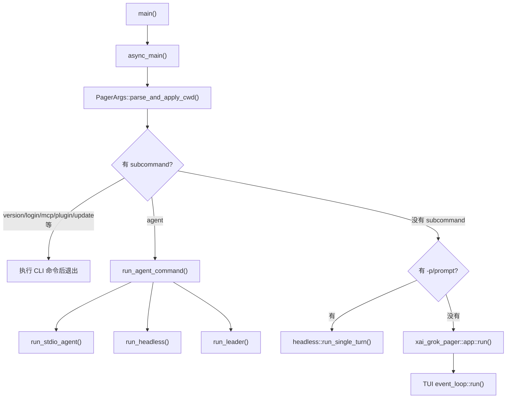

# 02. 启动流程和运行模式

这一章解释 `grok` 命令启动后做了什么。主文件是：

```text
crates/codegen/xai-grok-pager-bin/src/main.rs
```

## 二进制入口

`xai-grok-pager-bin/Cargo.toml` 里声明：

```toml
[[bin]]
name = "xai-grok-pager"
path = "src/main.rs"
```

所以源码里的二进制叫 `xai-grok-pager`。README 说明官方发布时把它作为 `grok` 命令交付。

这个 crate 被称为 composition-root package，因为它把 UI crate、agent runtime crate、update、telemetry、workspace 等依赖都连起来。

## `main()` 做什么

`main()` 可以按顺序理解为 8 步：

1. 安装 minimal render mode 的 hook：`xai_grok_pager_minimal::install()`。
2. 按 feature 安装 jemalloc、内存 trace、heap profile hooks。
3. 如果当前进程其实是 Mermaid render subprocess，就直接跑渲染子进程并退出。
4. 初始化内存 trace、提高 fd limit、校验 managed requirements。
5. 初始化 Sentry / crash handler / user guide docs 抽取。
6. 收集上次 crash 的 session 信息。
7. 创建 Tokio multi-thread runtime。
8. 用 `run_and_shutdown(runtime, async_main(), ...)` 跑真正的异步主逻辑。

一句话：`main()` 主要做进程级初始化，真正按命令分流发生在 `async_main()`。

## `async_main()` 的命令分流

`async_main()` 开始时解析命令行：

```rust
let mut args = PagerArgs::parse_and_apply_cwd()?;
```

`PagerArgs` 和各个 subcommand 定义在：

```text
crates/codegen/xai-grok-pager/src/app/cli.rs
```

顶层 subcommand 是 `Command` enum。常见命令包括：

| 命令 | 大致作用 |
| --- | --- |
| `grok` | 默认启动 TUI。 |
| `grok --help` | Clap 自动生成帮助。 |
| `grok --version` 或 `grok version` | 打印版本。 |
| `grok -p "..."` | headless 单轮 prompt。 |
| `grok agent stdio` | 以 ACP stdio agent 方式运行，常用于 IDE/桌面端。 |
| `grok agent headless` | 通过 Grok WebSocket relay 跑 headless agent。 |
| `grok agent leader` | 启动共享 leader 后端。 |
| `grok leader list/info/kill` | 管理 leader 进程。 |
| `grok workspace ...` | 管理 workspace 暴露到 hub。 |
| `grok login/logout` | 登录/退出。 |
| `grok mcp ...` | 管理 MCP server 配置。 |
| `grok plugin ...` | 管理插件。 |
| `grok sessions ...` | 列出、搜索、恢复 session。 |
| `grok update ...` | 检查或安装更新。 |

## 默认 TUI 模式

如果没有 subcommand，也没有 headless prompt，最后会走到：

```rust
xai_grok_pager::app::run(args, bg_update_rx).await
```

这会进入 TUI：

1. 加载配置。
2. 刷新认证。
3. 预取模型和 remote settings。
4. 判断是否使用 leader。
5. 准备 session startup intent，例如新建、resume、fork。
6. 建立 ACP 连接。
7. 初始化 terminal。
8. 进入 `app::event_loop::run(...)`。

## Headless 单轮模式

如果传了 prompt，例如类似：

```sh
grok -p "解释这个项目"
```

`async_main()` 会构造 `HeadlessPrompt`，然后调用：

```rust
xai_grok_pager::headless::run_single_turn(...)
```

这个模式没有全屏 TUI，适合脚本和 CI。它仍然会使用 agent runtime 和工具，只是输入输出是命令行形式。

## Agent 子命令

`grok agent ...` 由 `run_agent_command(...)` 处理，最终会进入 `xai-grok-shell/src/agent/app.rs` 中的不同函数：

| 函数 | 模式 | 说明 |
| --- | --- | --- |
| `run_stdio_agent` | stdio | 通过 stdin/stdout 跑 ACP JSON-RPC。 |
| `run_headless` | headless | 通过 Grok relay WebSocket 跑。 |
| `run_leader` | leader | 启动共享 agent 后端，多个 client 可连接。 |
| `run_agent_server` | serve | WebSocket server 模式。 |

这些函数的共同核心是：创建一个 `MvpAgent`，把它接到 ACP 连接上。

## Leader 模式是什么

leader 是一个共享后端进程。它解决的问题是：多个 UI/client 可以连接同一个 agent 后端，共享 session 状态，也能让后台任务、relay、workspace 暴露等能力持续存在。

`run_leader` 的流程很清楚：

1. 用 WebSocket URL 计算 socket/lock 路径。
2. 获取 leader lock，避免多个 leader 冲突。
3. 先绑定本地 IPC socket，让 client 可以快速连上。
4. 做认证和模型预取。
5. 标记 ready。
6. 在 `LocalSet` 里启动 agent、IPC bridge、WebSocket bridge、config watcher、auto-update checker。

leader 有几个重要概念：

- IPC：本地 client 和 leader 通信。
- relay：leader 和 grok.com WebSocket 通信。
- readiness gate：leader socket 可以先启动，但 ACP 消息要等 auth/prefetch 完成后才正常转发。
- activity tracking：用于判断是否可以 auto-update 或 shutdown。

## 为什么有 `LocalSet`

你会在 `xai-grok-shell/src/agent/app.rs` 里看到很多：

```rust
let local_set = tokio::task::LocalSet::new();
local_set.run_until(async move { ... }).await
```

原因是 agent/session 内部用了很多 `Rc`、`RefCell` 这类单线程类型，它们不是 `Send`，不能随便在线程间移动。`LocalSet` 可以让这些任务固定在同一个线程上用 `spawn_local` 跑。

新手可以先这样理解：

- `tokio::spawn`：任务可能在线程池里移动，需要 `Send`。
- `tokio::task::spawn_local`：任务只在当前 LocalSet 的线程里跑，不需要 `Send`。

## 运行模式总图



你读 `main.rs` 时，建议先搜索这些关键点：

```sh
rg -n "fn main|async fn async_main|Command::|run_agent_command|run_headless|app::run" crates/codegen/xai-grok-pager-bin/src/main.rs
```
