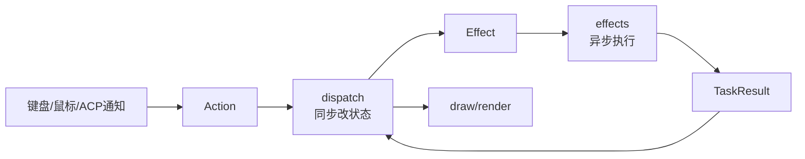

# 03. TUI 架构

TUI 层主要在：

```text
crates/codegen/xai-grok-pager
```

它负责用户看见的一切：欢迎页、输入框、滚动历史、工具执行块、弹窗、dashboard、主题、鼠标和键盘交互。

## 核心模块

先看：

```text
crates/codegen/xai-grok-pager/src/lib.rs
crates/codegen/xai-grok-pager/src/app/mod.rs
```

`app/mod.rs` 的顶部已经给出模块说明，可以翻译成白话：

| 模块 | 作用 |
| --- | --- |
| `actions` | 定义 UI 里可能发生的“用户意图”和“异步任务结果”。 |
| `agent` | AgentSession、AgentId、TurnState 等业务状态类型。 |
| `agent_view` | 单个 agent/session 的视图状态和输入/绘制逻辑。 |
| `app_view` | 整个应用的根状态，知道当前在欢迎页、agent 页还是 dashboard。 |
| `dispatch` | 同步地修改状态，把要做的异步事描述成 `Effect`。 |
| `effects` | 真正执行异步事，比如发 ACP 请求、读写配置、打开链接。 |
| `acp_handler` | 接收 agent 发回来的通知，转成 UI 状态变化。 |
| `event_loop` | 主循环，负责把 terminal 事件、ACP 消息、task result 串起来。 |

## Action / Effect / TaskResult

最重要的文件：

```text
crates/codegen/xai-grok-pager/src/app/actions.rs
```

里面有三个核心 enum：

| 类型 | 可以怎么理解 |
| --- | --- |
| `Action` | 用户或系统产生的意图。例如 `SendPrompt`、`Quit`、`OpenUrl`。 |
| `Effect` | 状态更新后需要执行的异步副作用。例如创建 session、发送 prompt、加载历史。 |
| `TaskResult` | 异步任务完成后返回给 UI 的结果。例如 session 创建成功、模型切换完成。 |

这个模式很像前端里的 Redux / Elm 架构：



好处是：

- 状态变化集中在 `dispatch`，比较容易测试。
- 真实 I/O 集中在 `effects`，不污染纯状态逻辑。
- event loop 只做编排，不需要懂每个业务细节。

## `AppView`

文件：

```text
crates/codegen/xai-grok-pager/src/app/app_view.rs
```

`AppView` 是 TUI 的根组件。它拥有：

- 当前 active view：欢迎页、某个 agent、dashboard。
- 所有打开的 agent view。
- session picker、worktree dialog、auth state、trust state、voice state。
- 输入处理入口。
- 绘制入口。

`ActiveView` enum 表示当前显示哪个界面：

- `Welcome`
- `Agent(AgentId)`
- `AgentDashboard`

读 UI 状态时，可以从 `AppView` 开始看。

## `AgentView`

文件目录：

```text
crates/codegen/xai-grok-pager/src/app/agent_view/
```

`AgentView` 是单个会话页的 view-model。它通常包含：

- prompt 输入框。
- scrollback 视口。
- 当前 session 信息。
- 当前 turn 状态。
- 工具块、plan mode、queue、selection、modal 等 UI 状态。

如果你想改“一个会话页里怎么显示某个块”，大概率要看 `agent_view` 或 `views` / `render` 相关模块。

## `event_loop`

文件：

```text
crates/codegen/xai-grok-pager/src/app/event_loop.rs
```

这个文件顶部注释说得很准确：它是一个薄薄的 `tokio::select!` loop。它处理：

- terminal input events。
- ACP channel 消息。
- spawned tasks 的结果。
- animation tick。
- config watcher 热更新。
- 系统外观变化。

它不应该塞太多业务逻辑。业务逻辑应该去：

- `AppView::handle_input`
- `dispatch::dispatch`
- `effects::execute`
- `acp_handler`

## `dispatch`

文件：

```text
crates/codegen/xai-grok-pager/src/app/dispatch/mod.rs
```

`dispatch` 的注释写了几个重要不变量：

- 不碰 terminal。
- 不碰 network。
- 不碰 filesystem。
- 所有状态 mutation 都同步、确定。
- 异步工作只返回 `Effect` 描述，不立即执行。

这意味着：如果你要理解“按了一个键后 UI 状态怎么变”，优先看 dispatch。

## `effects`

文件：

```text
crates/codegen/xai-grok-pager/src/app/effects/mod.rs
```

`effects::execute(...)` 负责把 `Effect` 真正跑起来。例如：

- `Effect::CreateSession` 会发 `acp::NewSessionRequest`。
- `Effect::LoadSession` 会发 `acp::LoadSessionRequest`。
- `Effect::Logout` 会发认证相关请求。
- `Effect::SetWorkingDir` 会调用 `std::env::set_current_dir`。

异步任务完成后，会返回一个 `TaskResult`，再回到 dispatch 更新 UI。

## 发送 prompt 的 UI 侧链路

以“用户输入一句话然后按 Enter”为例：

1. terminal event 被 `event_loop` 收到。
2. `AppView::handle_input(...)` 把按键翻译成 `Action::SendPrompt(text)`。
3. `dispatch::dispatch(...)` 处理这个 action：
   - 清空输入框或更新队列。
   - 把 UI 状态切到 running。
   - 返回一个发送 prompt 的 `Effect`。
4. `effects::execute(...)` 把 `Effect` 转成 ACP 请求，发给 agent。
5. agent 开始处理 prompt。
6. agent 通过 ACP notification 发回：
   - 用户消息回显。
   - assistant 文本增量。
   - tool call 开始/结束。
   - turn completed。
7. `acp_handler` 把这些通知应用到 `AgentView`。
8. TUI 下一帧渲染显示。

这条链路跨了 UI 和 shell，但 UI 侧你先看：

```text
actions.rs
app_view.rs
dispatch/
effects/
acp_handler/
```

## 三种 screen mode

`app/mod.rs` 里有 `ScreenMode`：

| 模式 | 说明 |
| --- | --- |
| `Fullscreen` | 使用 alternate screen 的全屏 TUI。 |
| `Inline` | 不进全屏，在普通终端流里显示。 |
| `Minimal` | scrollback-native 模式，主要渲染在 terminal 原生 scrollback 里。 |

minimal 的真实渲染在 sibling crate：

```text
crates/codegen/xai-grok-pager-minimal
```

`xai-grok-pager` 里只有 hook/API seam，让 full pager 不直接依赖 minimal 实现，避免 Cargo cycle。

## 读 UI 功能的套路

假设你想知道 `/resume` 或某个快捷键如何工作，可以这样追：

```sh
rg -n "Resume|ShowSessionPicker|LoadSession" crates/codegen/xai-grok-pager/src/app
```

然后按这个顺序看：

1. `actions.rs`：有没有对应 Action / Effect / TaskResult。
2. `app_view.rs` 或 `agent_view`：输入是在哪里变成 Action 的。
3. `dispatch/`：Action 如何改状态。
4. `effects/`：Effect 如何发 ACP 或做 I/O。
5. `acp_handler/`：agent 回包如何更新 UI。

不要一开始就跳到 render，因为 render 只负责“把已有状态画出来”。
