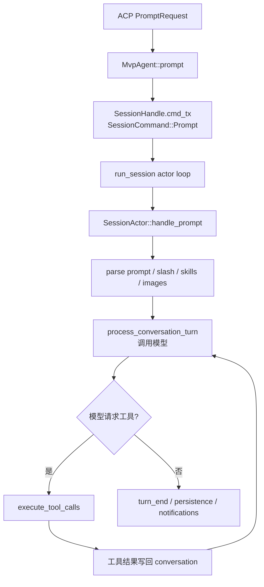

# 04. Agent 和 Session 运行时

这一章进入项目最核心的后端逻辑：agent 如何初始化、创建 session、接收 prompt、调用模型和工具。

主要路径：

```text
crates/codegen/xai-grok-shell
crates/codegen/xai-grok-agent
```

## 两个 crate 的分工

| crate | 负责什么 |
| --- | --- |
| `xai-grok-shell` | 运行时：认证、模型、ACP、session actor、prompt loop、leader/headless/stdio。 |
| `xai-grok-agent` | 定义和构建 agent：AgentDefinition、AgentBuilder、system prompt、ToolBridge。 |

可以这样理解：

- `xai-grok-agent` 负责“造出一个 agent 对象”。
- `xai-grok-shell` 负责“让这个 agent 在真实会话里跑起来”。

## `MvpAgent`

核心文件：

```text
crates/codegen/xai-grok-shell/src/agent/mvp_agent/mod.rs
crates/codegen/xai-grok-shell/src/agent/mvp_agent/acp_agent.rs
crates/codegen/xai-grok-shell/src/agent/mvp_agent/agent_ops.rs
```

`MvpAgent` 是 ACP Agent trait 的实现者。它持有很多 runtime 状态：

- `sessions`：session id 到 `SessionHandle` 的映射。
- `session_threads`：session actor 所在线程/任务。
- `initialize_request`：ACP initialize 请求缓存。
- `gateway`：给 client 发通知的通道。
- `cfg`：agent 配置。
- `auth_manager`：认证状态和 token 刷新。
- `models_manager`：模型目录和模型可用性。
- `chat_modes`：chat 产品模式。
- `sampling_config`：模型调用配置。
- plugin / skill / managed MCP / subagent / codebase index 等状态。

你不需要一次理解所有字段。先记住：`MvpAgent` 是“ACP 请求入口 + session 管理器”。

## ACP trait 方法

`acp_agent.rs` 里实现：

```rust
impl acp::Agent for MvpAgent
```

最重要的方法：

| 方法 | 作用 |
| --- | --- |
| `initialize` | client 第一次连接时调用，交换能力、初始化 auth/model/tool metadata、启动清理任务。 |
| `new_session` | 创建新的 session。 |
| `load_session` | 恢复已有 session，并 replay 历史事件。 |
| `prompt` | 接收用户 prompt，把它送进对应 session actor。 |

如果你只追主链路，先看这四个方法。

## 创建 session 的大致流程

`new_session` 做的事很多，但可以按层次理解：

1. 确认 `initialize` 已经调用过。
2. 解析 cwd 和 request meta。
3. 处理 folder trust。
4. 合并 MCP servers。
5. 生成或校验 session id。
6. 决定 session model、yolo/auto mode、chat kind 等。
7. 准备 `SessionInfo`。
8. 调用 `spawn_and_register_session(...)`。

`spawn_and_register_session` 在 `agent_ops.rs` 里，是真正搭 session actor 的地方。它会：

- 选择文件系统 backend：本地 FS 或 ACP FS。
- 创建 terminal backend。
- 初始化 hunk tracker。
- 加载 `.envrc` / Claude env / color env。
- 构造 `ToolContext`。
- 解析 workspace ops。
- 构建 `Agent`，包括 system prompt 和 ToolBridge。
- 创建 `SessionActor`。
- 返回 `SessionHandle` 并注册到 `MvpAgent.sessions`。

## `AgentDefinition`、`AgentBuilder`、`Agent`

文件：

```text
crates/codegen/xai-grok-agent/src/config.rs
crates/codegen/xai-grok-agent/src/builder.rs
crates/codegen/xai-grok-agent/src/agent.rs
```

### `AgentDefinition`

`AgentDefinition` 描述 agent 配置。它可以从 Markdown + YAML frontmatter 解析：

```text
---
name: my-agent
description: A custom agent
tools: [read_file, grep]
---

这里是 system prompt body。
```

字段包括：

- `name` / `description`
- `prompt_mode`
- `tool_config`
- `permission_mode`
- `skills`
- `agents_md`
- `inject_default_tools`
- `tools` / `disallowed_tools`
- `model`
- `mcp_servers`
- `memory`
- `completion_requirement`

### `AgentBuilder`

`AgentBuilder::build()` 是完整构建流程。它会：

1. 解析最终 definition。
2. 发现 skills。
3. 构造 tool config。
4. 根据功能开关注入默认工具，比如 memory、web_search、web_fetch、LSP、image、plan mode tools。
5. 根据 allowlist / denylist 过滤工具。
6. 调用 `ToolBridge::finalize_builder(...)`。
7. 读取 AGENTS.md。
8. seed skill discovery。
9. 渲染 `PromptContext` 成 system prompt。
10. 返回 `Agent`。

### `Agent`

`Agent` 是构建完成的对象，包含：

- `definition`
- `prompt_context`
- `system_prompt`
- `tool_bridge`
- reminder / compaction policy
- hosted server-side tools

它和 session 绑定，不是可随便跨 session 复用的纯配置对象。

## `SessionHandle`

文件：

```text
crates/codegen/xai-grok-shell/src/session/handle.rs
```

`SessionHandle` 是外部和 session actor 交互的“遥控器”。它里面最关键的是：

```rust
pub cmd_tx: mpsc::UnboundedSender<SessionCommand>
```

也就是说，外部不直接调用 session actor 的内部方法，而是给它发 `SessionCommand`。

这个模式很重要：

- actor 自己拥有状态。
- 外部只发消息。
- 通过 `oneshot` channel 拿返回值。
- 更容易保证顺序和并发安全。

## `SessionCommand`

文件：

```text
crates/codegen/xai-grok-shell/src/session/commands.rs
```

`SessionCommand` 是 session actor 的消息协议。常见命令：

| 命令 | 说明 |
| --- | --- |
| `Initialize` | 初始化 session system prompt。 |
| `Prompt` | 跑一轮用户 prompt。 |
| `SessionMode` | 切换 prompt mode。 |
| `SetSessionModel` | 切换模型。 |
| `CompactSession` | 压缩上下文。 |
| `ReloadPlugins` | 重载插件。 |
| `ListTasks` / `KillBackgroundTask` | 管理后台任务。 |
| `Cancel` / `Interject` | 取消或插入中途消息。 |

`Prompt` 命令带的字段很多，因为一轮 prompt 需要的信息很多：

- `prompt_id`
- `prompt_blocks`
- `prompt_mode`
- trace/upload context
- client identifier
- screen mode
- `verbatim`
- `json_schema`
- `send_now`
- `respond_to`
- `persist_ack`
- `parsed_prompt_tx`

## `SessionActor`

核心文件：

```text
crates/codegen/xai-grok-shell/src/session/acp_session.rs
crates/codegen/xai-grok-shell/src/session/acp_session_impl/
```

`SessionActor` 字段非常多，它拥有一场会话的真实运行状态：

- session info。
- auth method。
- notification sender。
- permission handle。
- tool context。
- MCP state。
- chat state。
- file state tracker。
- prompt mode / plan mode。
- compaction / memory 状态。
- current prompt id。
- pending interactions。
- 构建好的 `Agent`。

它的实现被拆在 `acp_session_impl/` 目录下：

| 文件 | 大致负责 |
| --- | --- |
| `run_loop.rs` | actor 主循环，接收 `SessionCommand`。 |
| `turn.rs` | 一轮 prompt 的主流程。 |
| `tool_calls.rs` | 模型请求工具后的工具执行流程。 |
| `prompt_build.rs` | prompt 构建和系统提醒。 |
| `mcp.rs` | MCP 工具和 server 状态。 |
| `slash_exec.rs` | slash command 执行。 |
| `session_mode.rs` | agent/plan mode 切换。 |
| `turn_end.rs` | 一轮结束时的收尾。 |
| `spawn.rs` | session actor 构造相关。 |

## 一轮 prompt 的流程

主入口：

```text
crates/codegen/xai-grok-shell/src/session/acp_session_impl/turn.rs
```

`handle_prompt(...)` 可以按下面理解：

1. 记录 prompt 开始、清理 active skill。
2. 根据 `prompt_id` 判断是不是 synthetic prompt。
3. 更新 plan mode / turn state / telemetry。
4. 如果是直接 bash 命令，走 direct bash path。
5. 解析 slash command：
   - builtin slash 直接执行。
   - skill slash 变成 skill invocation。
   - 普通 prompt 继续。
6. 发 `TurnStarted` 事件。
7. 把用户消息 chunk 发给 UI 和持久化。
8. 调用 `parse_prompt_with_skills(...)` 拆分 context / query / image / skill info。
9. 处理图片 normalize、大 prompt 截断、AGENTS.md/skill 信息注入。
10. 把用户消息写入 chat state。
11. 调用 `process_conversation_turn_with_recovery(...)`。
12. 如果模型返回 tool calls，进入 `execute_tool_calls(...)`。
13. 工具结果被写回 conversation，模型继续下一步。
14. 没有更多 tool call 后，结束 turn，发完成通知，持久化。

简化图：



## 为什么 prompt 不直接执行工具

模型输出的是“我要调用某个工具，参数是什么”。真正执行前，session actor 会做很多检查：

- 工具名是否存在。
- 参数能不能 parse 成 `ToolInput`。
- 当前 plan mode 是否允许编辑。
- 权限系统是否允许。
- MCP 是否初始化。
- hook 是否拒绝。
- 是否需要中断等待工具。

所以工具执行是一个受控流程，不是模型随便执行代码。

## 如何读这一层

如果你想追“发送一句话”：

```sh
rg -n "async fn prompt|SessionCommand::Prompt|handle_prompt|process_conversation_turn|execute_tool_calls" crates/codegen/xai-grok-shell/src
```

建议顺序：

1. `agent/mvp_agent/acp_agent.rs` 的 `prompt`。
2. `session/commands.rs` 的 `SessionCommand::Prompt`。
3. `session/acp_session_impl/run_loop.rs` 里处理 `SessionCommand::Prompt` 的 match arm。
4. `session/acp_session_impl/turn.rs` 的 `handle_prompt`。
5. `session/acp_session_impl/tool_calls.rs` 的 `execute_tool_calls`。
