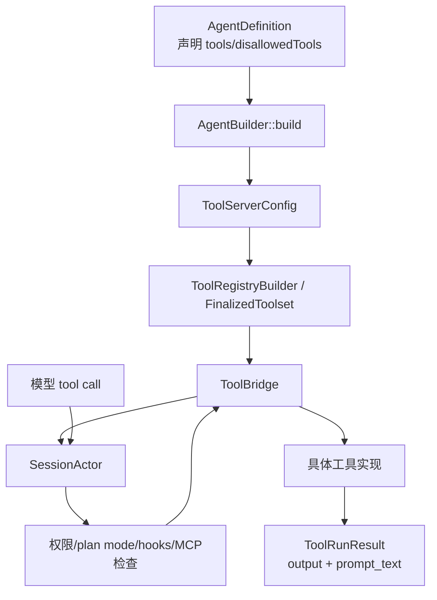

# 05. 工具、Workspace 和权限

这一章解释模型为什么能读文件、跑命令、搜索、编辑代码，以及这些能力如何被权限系统约束。

主要路径：

```text
crates/codegen/xai-grok-tools
crates/codegen/xai-grok-workspace
crates/codegen/xai-grok-agent/src/builder.rs
crates/codegen/xai-grok-shell/src/session/acp_session_impl/tool_calls.rs
```

## 工具系统的大图



## `ToolBridge`

核心文件：

```text
crates/codegen/xai-grok-tools/src/bridge.rs
```

`ToolBridge` 是工具系统的门面。注释里说它做三件事：

1. 拥有注册好的 `ToolRegistry`。
2. 通过 `call(...)` 调度工具执行。
3. 管理工具定义、启用/禁用、名称覆盖。

`ToolBridgeResult` 有两个核心字段：

| 字段 | 作用 |
| --- | --- |
| `output` | 结构化工具输出，给 UI、JSON 序列化、hunk tracking 用。 |
| `prompt_text` | 放回模型上下文里的纯文本结果。 |

这点很重要：给 UI 展示的结构化结果，和给模型继续推理的文本结果，不一定完全一样。

## 工具注册在哪里发生

入口在：

```text
crates/codegen/xai-grok-agent/src/builder.rs
```

`AgentBuilder::build()` 会：

1. 从 `AgentDefinition` 拿到初始 `tool_config`。
2. 根据功能开关注入工具：
   - memory search/get
   - web search
   - web fetch
   - LSP
   - image gen/edit
   - video tools
   - OpenCode write fallback
   - plan mode tools
3. 根据 `tools` allowlist 和 `disallowed_tools` denylist 过滤。
4. 根据 subagent 开关决定是否保留 `task` 等工具。
5. 调用：

```rust
ToolBridge::finalize_builder(tool_bridge_builder, tool_config, SessionContext { ... })
```

`SessionContext` 会把工具运行需要的上下文塞进去，例如：

- cwd
- filesystem backend
- terminal backend
- session folder
- session env
- notification handle
- skills
- memory backend
- web search / web fetch config
- LSP backend
- image/video config
- API key provider

## 工具实现分布

入口文件：

```text
crates/codegen/xai-grok-tools/src/implementations/mod.rs
```

里面 re-export 了很多工具族：

| 模块 | 例子 |
| --- | --- |
| `grok_build` | `BashTool`、`ReadFileTool`、`SearchReplaceTool`、`TaskTool`、`WebFetchTool`、`TodoWriteTool`。 |
| `grok_build_concise` | 更短命名的工具版本。 |
| `opencode` | `OpenCodeBashTool`、`OpenCodeReadTool`、`OpenCodeWriteTool` 等。 |
| `codex` | Codex 风格工具实现。 |
| `memory` | memory search/get。 |
| `skills` | skill discovery 和 skill 调用。 |
| `web_search` | web search 配置和实现。 |
| `lsp` | LSP 相关工具。 |
| `task_output` | 等待或读取后台任务结果。 |
| `use_tool` | meta-dispatch 工具。 |

你想看具体工具，就从这里跳到对应模块。

## 工具执行流程

核心文件：

```text
crates/codegen/xai-grok-shell/src/session/acp_session_impl/tool_calls.rs
```

主要函数：

- `execute_tool_calls(...)`
- `prepare_tool_call(...)`

大致流程：

1. 模型返回一组 tool calls。
2. 对每个 tool call 发 `ToolStarted` 事件。
3. `prepare_tool_call`：
   - 解析参数。
   - 识别工具类型。
   - 检查 plan mode edit gate。
   - 处理 permission request。
   - 处理 hooks。
   - 判断是否 defer/follow-up/cancel。
4. approved 的工具通过 `ToolBridge::call(...)` 执行。
5. 工具结果变成：
   - UI notification。
   - conversation 里的 tool result。
   - telemetry / hunk tracking / persistence 事件。

## 权限系统

路径：

```text
crates/codegen/xai-grok-workspace/src/permission/
```

入口：

```text
crates/codegen/xai-grok-workspace/src/permission/mod.rs
crates/codegen/xai-grok-workspace/src/permission/manager.rs
```

权限系统处理这些问题：

- bash 命令是否安全。
- 文件读写是否需要用户确认。
- MCP 工具是否已经被允许。
- always-approve / auto / ask 模式如何决策。
- managed policy 是否强制禁止某些行为。
- 是否通过 hub/client 向用户发 permission prompt。

`PermissionHandle` 有几种形态：

- `Actor`：真实权限 actor。
- `AllowAll`：测试或特殊模式下允许全部。

常见权限模式：

| 模式 | 大致含义 |
| --- | --- |
| ask | 有风险操作问用户。 |
| auto | 用规则和 classifier 尝试自动判断。 |
| always-approve/yolo | 尽量自动允许，但仍可能被 managed policy 或 plan mode gate 限制。 |

注意：plan mode 的编辑限制不完全依赖权限系统。`tool_calls.rs` 中有专门的 `plan_mode_edit_gate(...)`，即使 always-approve 也会限制 plan mode 下的编辑范围。

## Workspace 层

路径：

```text
crates/codegen/xai-grok-workspace
```

workspace 负责项目文件和远程工作区能力。

### 文件系统抽象

文件：

```text
crates/codegen/xai-grok-workspace/src/file_system/fs.rs
```

核心 trait：

```rust
pub trait AsyncFileSystem: Send + Sync {
    fn root(&self) -> &Path;
    async fn exists(&self, path: &Path) -> Result<bool, FsError>;
    async fn read_file(&self, path: &Path) -> Result<Vec<u8>, FsError>;
    async fn try_read_file(&self, path: &Path) -> Result<Option<Vec<u8>>, FsError>;
    async fn write_file(&self, path: &Path, data: &[u8]) -> Result<(), FsError>;
    async fn delete_file(&self, path: &Path) -> Result<(), FsError>;
}
```

为什么要抽象文件系统？

- 本地 TUI 可以直接读写本地文件。
- 某些 client 可能通过 ACP 文件系统读写。
- workspace proxy 可以把请求转到远程 workspace server。
- 测试可以用 mock fs。

### `WorkspaceOps`

文件：

```text
crates/codegen/xai-grok-workspace/src/workspace_ops.rs
```

它的注释很关键：WorkspaceOps 有两种模式：

| 模式 | 说明 |
| --- | --- |
| `Local` | 扩展请求通过本地 `WorkspaceHandle`，工具调用通过本地 session 的 `FinalizedToolset`。 |
| `Proxy` | 请求序列化后通过 hub WebSocket 发到远程 workspace server。 |

`WorkspaceOp` trait 把本地执行和 RPC wire contract 绑在一起：

- 每个 RPC request 类型实现 `WorkspaceRpc`，有 `METHOD` 和 `Response`。
- 本地模式下实现 `execute(...)`。
- proxy 模式下序列化走 server。

这样做的好处是类型安全：改字段时编译器能帮你发现本地和远程两边不一致。

## Git、hunk、worktree

workspace 层还负责：

- `session/git.rs`：git status/diff/commit 等。
- `xai-hunk-tracker`：追踪 agent 修改的 hunk，用于接受/拒绝或统计。
- `worktree/`：创建、管理、清理 git worktree。
- rewind checkpoint：回滚某一轮之前的文件状态。

这解释了为什么 session 创建时会创建 hunk tracker、file state tracker、workspace ops：这些能力都要和每个 session 绑定。

## MCP 工具

MCP 工具不是编译时固定工具，而是从 MCP servers 动态发现/注册。

大致位置：

```text
crates/codegen/xai-grok-shell/src/session/acp_session_impl/mcp.rs
crates/codegen/xai-grok-mcp
```

MCP 工具最终也会注册到 `ToolBridge`，所以模型调用时仍然走统一的 tool call pipeline。

## 你该怎么读工具相关代码

如果想追“模型调用 read_file 工具”：

```sh
rg -n "ReadFileTool|read_file|execute_tool_calls|prepare_tool_call|ToolBridge::call" crates/codegen
```

建议顺序：

1. `xai-grok-agent/src/builder.rs`：工具如何被加入 tool config。
2. `xai-grok-tools/src/implementations/mod.rs`：工具实现在哪个模块。
3. `xai-grok-tools/src/bridge.rs`：工具如何统一调用。
4. `xai-grok-shell/src/session/acp_session_impl/tool_calls.rs`：执行前有哪些检查。
5. `xai-grok-workspace/src/permission/`：为什么某些工具会要求确认。
